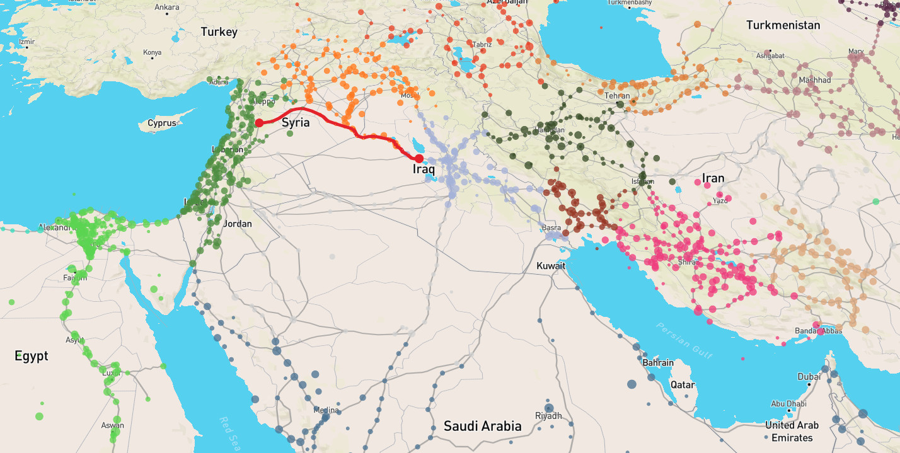

# react-orbis-esque

This result of the [ORBIS-esque hackathon](http://dig-hum.de/aktuelles/open-call-modeling-travels-history-orbis-esque-hackathon-uni-vienna-july-18-20-2018)
in Vienna is an experiment to extract a simple, re-usable [React](https://reactjs.org/)
routing component from the codebase of [al-Ṯurayyā](https://orbis-esque-hackathon.github.io/althurayya/).

## Live Demo

A live demo is available at [https://orbis-esque-hackathon.github.io/react-orbis-esque/](https://orbis-esque-hackathon.github.io/react-orbis-esque/)

## Using the React component

--  TODO --

## Hacking on the code

You need __node.js__ and __npm__ installed on your machine. (Tested with
node.js v4.2.6 and npm v6.1.0.)

- Clone this repository
- Create a copy of `src/conf/constants.TEMPLATE.js` named `src/confg/constants.js`
  and add your own Mapbox API key
- Run `npm install` to install project dependencies
- Run `npm start` and go to [http://localhost:7171](http://localhost:7171)
